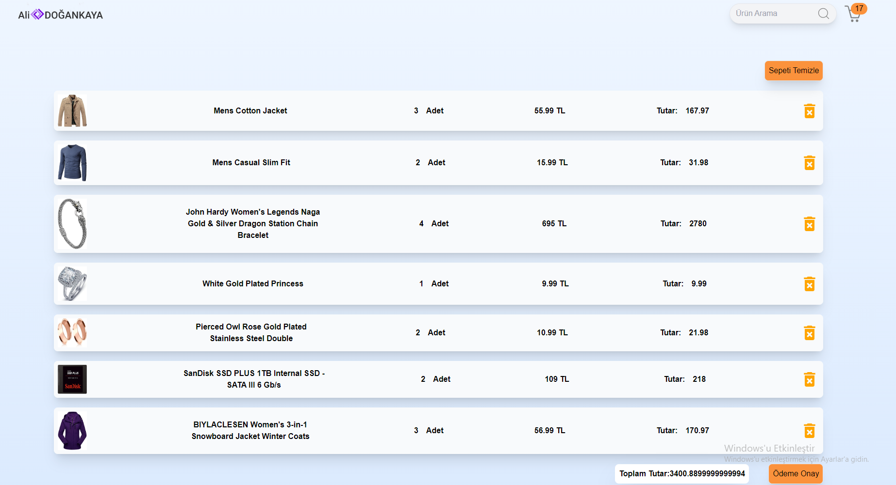

# E-Commerce React Application + Vite + Redux Toolkit +Tailwind CSS -React-Toastify

This template provides a minimal setup to get React working in Vite with HMR and some ESLint rules.

Currently, two official plugins are available:

- [@vitejs/plugin-react](https://github.com/vitejs/vite-plugin-react/blob/main/packages/plugin-react/README.md) uses [Babel](https://babeljs.io/) for Fast Refresh
- [@vitejs/plugin-react-swc](https://github.com/vitejs/vite-plugin-react-swc) uses [SWC](https://swc.rs/) for Fast Refresh

## Features
- **Product Listings**: Browse products with detailed descriptions and prices.
- **Shopping Cart**: Add, remove, and update items in your cart.
- **Order Management**: Place orders and view order history.
- **Responsive Design**: Mobile and desktop friendly.

## Screenshots

## Technologies Used
- **Frontend**: React, Redux, React Router,Redux-Toolkit
- **Backend**: Node.js, Express 
- **Database**:https://fakestoreapi.com/
- **Styling**: Tailwind CSS, Bootstrap,
